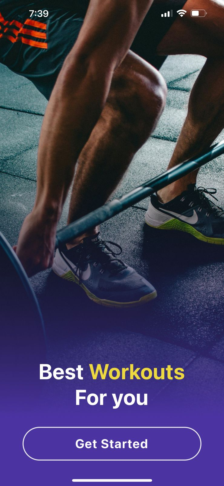
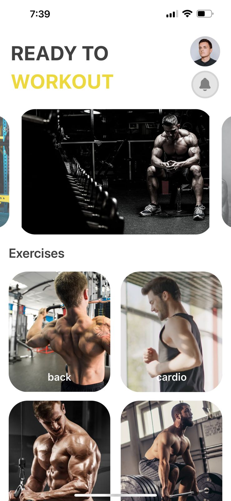
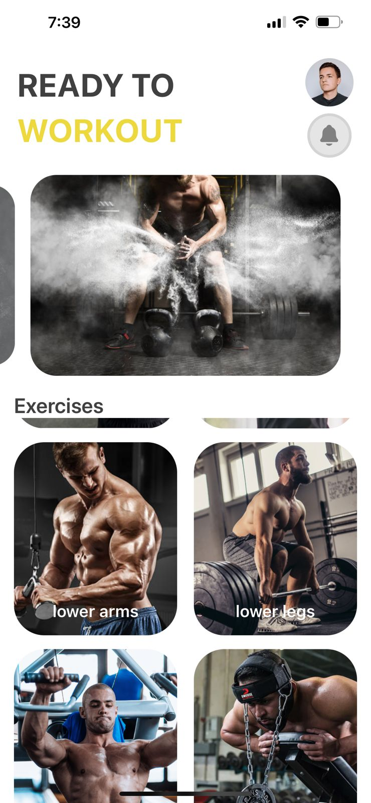
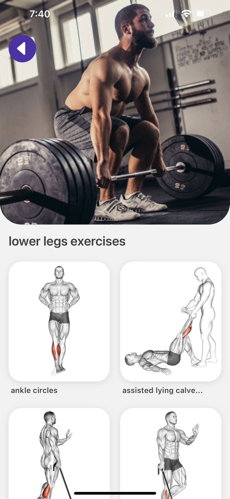
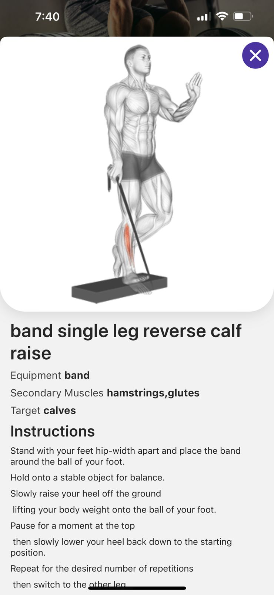

# fitness app react native

 

## Table Of Contents

- [About the Project](#about-the-project)
- [Demonstration & Features](#demonstration)
- [Technologies Used](#technologies-used)

## About The Project

Developed a comprehensive Gym App that provides users with an extensive database of exercises. The app enables users to access detailed information on various gym exercises, including step-by-step instructions, targeted muscle groups, and accompanying visuals. The user-friendly interface ensures easy navigation, allowing individuals to explore and incorporate diverse workout routines into their fitness regimens. This project showcases my proficiency in mobile app development, user experience design, and my commitment to promoting health and fitness through technology.

## Demonstration -->

  
  
  
  
  
  

### Technologies Used

- Frontend
  - React Native
  - Tailwind CSS
- API
  - ExerciseDB

 
